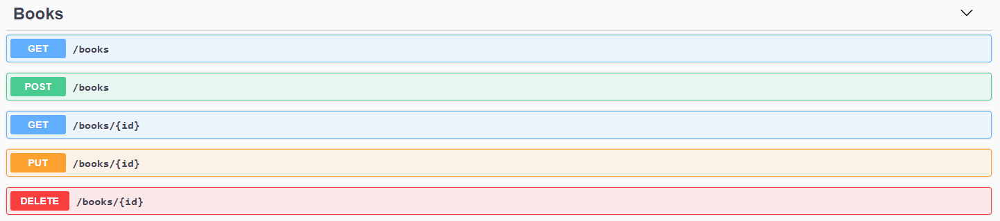

# Projeto AspNetCoreWebApiDockerApp

Projeto criado com o objetivo de praticar conceitos referentes ao docker, containers e imagens.

### Premissas

Já ter a network 'library-network' criada. Ela será utilizada por ambos os containers (API e BD).

### **Escopo**

Este projeto contém uma API simples para consulta de livros, e a imagem (docker) que deverá ser utilizada para comunicação com a tabela books na nossa base de dados mysql.

### **API**

Descrição: API simples a qual possui apenas um CRUD de livros a serem persistidos no bando de dados via container.



### **BD**

No diretório de ```bd\```

Está presente o dockerfile criado para configuração da base de dados utilizada pelo nosso projeto. ```tests\bd.mysql.dockerfile```

Para mais informações: [Library Database](bd/).

### **Src**

No diretório ```src/AspNetCoreWebApiDockerApp/AspNetCoreWebApiDockerApp.Api```

#### Building Project

```dotnet build```

#### Running Project

```dotnet run```

### Restore Project

```dotnet restore```

#### Publish Project

```dotnet publish -c Release```

Obs: Para utilizar as variáveis de ambiente de Release, devemos ter o arquivo ```appsettings.Production.json``` já criado. ("Release = Production")

#### Imagem da API via dockerfile

A partir do diretório ```\AspNetCoreWebApiDockerApp\```

Executar o comando ```docker build -f Dockerfile -t tiagopala/api-library-app .``` para buildar a imagem.

Executar o comando ```docker run -d --name libraryapi -p "80:80" --network library-network tiagopala/api-library-app```

Ele irá subir a imagem expondo a porta 80 à ser utilizada pela aplicação dentro da rede library-network utilizada na comunicação entre os containers.